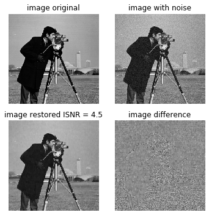
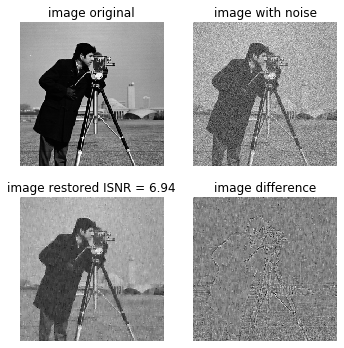

Arsenal of image processing filters (in spatial domain):
    
* Histogram equalization

* Local histogram equalization

* Spatially adaptive smoothing filters (preserve edges):
  * flat kernel (application: uniform and Gaussian noise)
  * gaussian kernel (application: uniform and Gaussian noise)
  
* Order statistic filters
  * Median kernel (application: impulsive noise)
  * Min kernel (application: salt noise)
  * Max kernel (application: pepper noise)
  * Mid-point kernel (application: uniform and Gaussian noise)
  * Alpha-trimmed-mean kernel (application: Gaussian + impulsive noise)
  
* Spatially adaptive order statistic filters (preserve edges):
  * Median kernel (application: impulsive noise)
  * Min kernel (application: salt noise)
  * Max kernel (application: pepper noise)
  * Mid-point kernel (application: uniform and Gaussian noise)
  * Alpha-trimmed-mean kernel (application: Gaussian + impulsive noise)
  
* Spatially adaptive smoothing Wiener filters (preserve edges):
  * flat kernel (application: uniform and Gaussian noise)
  * gaussian kernel (application: uniform and Gaussian noise)
  
* Spatially adaptive order statistic Wiener filters (preserve edges):
  * Median kernel (application: impulsive noise)
  * Min kernel (application: salt noise)
  * Max kernel (application: pepper noise)
  * Mid-point kernel (application: uniform and Gaussian noise)
  * Alpha-trimmed-mean kernel (application: Gaussian + impulsive noise)
    
* High boost filter (application: edge enhancement and de-enhancement)

* Homomorphic filter (application: contrast enhancement in dark and bright regions)

**Dummy dataset** 

Added Gaussian noise, mean 0, std dev 10
Spatially adaptive smoothing Wiener Filter

  

Added Gaussian noise, mean 0, std dev 30
Spatially adaptive smoothing Wiener Filter

  

